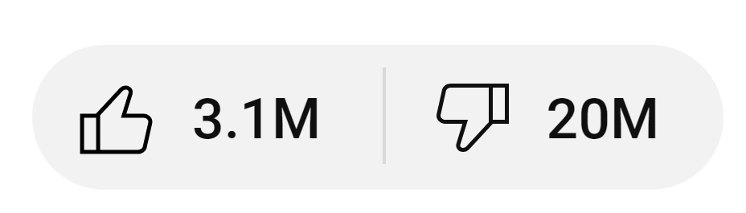

# ReShorts

Returns YouTube Dislikes to videos & shorts using the RYD API. A simpler working alternative to [Anarios/return-youtube-dislike](https://github.com/Anarios/return-youtube-dislike).

## Videos

ReShorts returns dislikes on YouTube videos by fetching data from the [Return YouTube Dislike API](https://returnyoutubedislike.com/docs/endpoints) and modifying the class names so the text is successfully rendered.

## Shorts

ReShorts returns dislikes on YouTube shorts the same way as it does on videos, but creates **clones** instead of modifying the text content. This is because YouTube listens for changes in their UI, and if it is an unexpected change, it will revert the change, meaning replacing the text content won't work.

---

Here's a quick video preview of the extension:

https://github.com/user-attachments/assets/d5b2f242-2aab-4eab-aaf7-45a83ce1c1c7

---

Made by Terry Kim.
